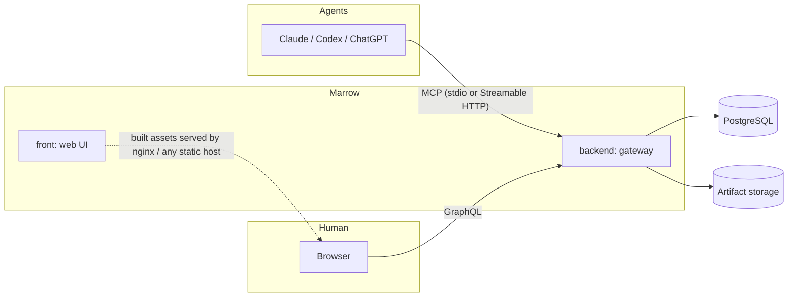

# Marrow

**Persistent, structured project memory for coding agents — over MCP.**

Marrow is a memory server coding agents (Claude, Codex, ChatGPT, and other
MCP-speaking clients) connect to instead of forgetting everything between
sessions. It stores projects, tasks, decisions, links between them, events,
common knowledge, and artifacts — then surfaces the *relevant* slice of that
back to an agent through `preflight`, `context.pack`, and `project.summary`,
instead of forcing it to re-read an entire repo's history to figure out
what already happened and why.

A companion web UI lets a human browse and curate the same memory: project
timelines, decision graphs, task boards, and a shared artifact/template
library.

> Formerly shipped as two separate repositories (`project-memory-mcp` /
> `PMemUI`) under the working name **PMem**. This monorepo continues that
> history via `git subtree` — see [Monorepo history](#monorepo-history) below.

## Why

Coding agents are stateless between sessions by default. Ask a fresh agent
"why did we choose X over Y here?" and it has no way to know unless someone
re-explains it — or it's willing to `git log`/`git blame` archaeology every
time. Marrow gives agents (and the humans working alongside them) a place to
record decisions, open tasks, known faults, and reusable memory once, and
retrieve exactly what's relevant on demand:

- `preflight` — the guardrail an agent runs before editing: relevant memory,
  open tasks, known faults for the area it's about to touch.
- `project.summary` — a compact "what is this project, what's the state,
  what should I look at next" card, so a second agent picking up a project
  cold doesn't have to download everything.
- `decision.list` / `link.list` — a traceable graph of *why* choices were
  made and how they relate, not just a flat log.

## Architecture



Two deployment modes, same tool surface:

- **Local-first** — a single agent runs the server over stdio, data lives in
  a local SQLite file. No network, no setup beyond `npm install`.
- **Shared gateway** — a long-running HTTP/MCP gateway backed by PostgreSQL,
  shared by multiple agents and human users, with per-user auth, OAuth for
  connector-based clients (ChatGPT/Claude web), and the GraphQL API the web
  UI runs on.

## Monorepo layout

```text
backend/   MCP server + shared gateway (Node/TypeScript, Fastify-style HTTP,
           PostgreSQL via Knex, GraphQL, OAuth facade). Package: @deadragdoll/marrow-back
front/     Web UI (React, TypeScript, Vite, Zustand, Apollo, Ant Design).
           Package: @deadragdoll/marrow-front
```

Each side has its own README with setup, environment variables, and
operational detail:

- [`backend/README.md`](backend/README.md) — local/gateway setup, MCP tool
  list, environment variables, deployment, and links to the full `backend/docs/`
  set (architecture, GraphQL API, auth model, agent workflows, nginx, backup/restore).
- [`front/README.md`](front/README.md) — CI/CD and build notes for the web UI.

## Quickstart (local-first)

```bash
cd backend
npm install
npm run build
node dist/src/index.js   # MCP server over stdio
```

Point any MCP-capable agent at that command. See
[`backend/README.md`](backend/README.md) for the shared-gateway setup
(PostgreSQL, HTTP/OAuth, the web UI's GraphQL endpoint) if you want multiple
agents and/or humans sharing one memory store instead.

## Key capabilities

- **Projects** — isolated memory scopes, plus a "common" scope shared across
  all of them.
- **Memory** — free-text notes/knowledge with full-text search (SQLite FTS5
  locally, PostgreSQL full-text in gateway mode).
- **Tasks** — create, claim, complete, with priorities and milestones.
- **Decisions** — recorded with rationale, superseding chains, and typed
  links to other decisions/tasks/memory.
- **Links & Events** — a queryable graph connecting records, plus an audit
  trail of what happened when.
- **Artifacts** — text/binary storage for templates, checklists, and docs,
  shared across projects or scoped to one.
- **Handoffs** — structured session handoff notes for continuing work across
  agent sessions.
- **Preflight / context packing** — the retrieval layer that turns all of the
  above into what an agent actually needs before it starts editing.

## CI/CD

A single `.gitlab-ci.yml` at the repo root builds and deploys both halves
independently, triggered by prefixed tags:

- `backend-vX.Y.Z` → builds and deploys the gateway.
- `front-vX.Y.Z` → builds and deploys the web UI.

Host-specific values (deploy paths, runner tags, production domain, etc.)
are injected via GitLab CI/CD variables — nothing environment-specific is
hardcoded in the pipeline itself.

## Monorepo history

Both halves were merged from previously separate repositories using
`git subtree`, preserving full commit history as reachable via merge commits.
`git log -- backend` / `git log -- front` won't show pre-merge commits
directly by default — use `git log --follow` or the original refs if you
need to trace history from before the merge.
